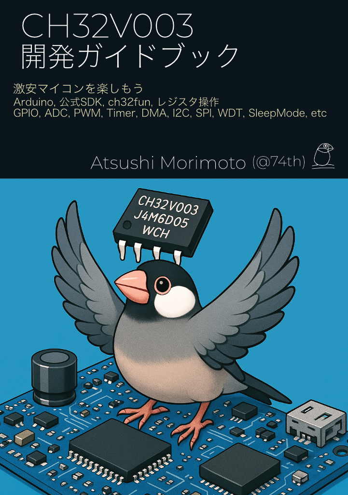

# CH32V003 Guidebook MCP Server

🇯🇵
CH32V003 ガイドブック MCP サーバー

This MCP Server helps develop CH32V003 firmware using the "CH32V003 Guidebook" written by @74th.

🇯🇵
@74th が執筆した技術同人誌『CH32V003 Guidebook』を利用したCH32V003ファームウェア開発用のMCP Serverプログラムです。



The guidebook will be available at Gijutsushoten18 (Japan’s largest indie tech-book fair) starting May 31, 2025!

🇯🇵
技術同人誌は、2025年5月31日スタートの技術書典18にて頒布します！

> CH32V003開発ガイドブック[74TH-B018] - 74th Books & Gadgets - BOOTH
>
> https://74th.booth.pm/items/6934072

> CH32V003 Development Guidebook: 74th
> CH32V003開発ガイドブック：74th
>
> https://techbookfest.org/product/qH8sBZPnJAREuL45aDSfpa

This repository references the book content and extracted documents via Git submodules. They are not open source and are provided only to book purchasers.
The MCP Server containing the guidebook content is distributed as free software.

🇯🇵
本リポジトリにはGitサブモジュールで、技術同人誌の本文及び抽出ドキュメントを参照していますが、こちらは書籍購入者向けとしてオープンソースにはしておりません。
技術同人誌の内容を含むMCP Serverを、フリーソフトウェアとして配布しています。

## Overview
## 概要

The tool `read_ch32v003_guide_book` is provided.
By specifying the framework and item arguments, the MCP Server returns relevant book content and sample code.

🇯🇵
ツール`read_ch32v003_guide_book`を提供します。
引数のframeworkとitemを指定することで、同人誌のコンテンツと、サンプルコードをMCP Serverが返します。

- framework:
  - WCH SDK
  - ch32fun
- item:
  - GPIO
  - Timer
  - DMA
  - ADC
  - PWM
  - I2C
  - SPI
  - UART
  - watchdogtimer

Please specify the framework in advance when instructing the LLM.
frameworkを指定する必要があるため、LLMにframeworkを指示しておいてください。

## Usage

🇯🇵
利用方法

Download the binary from the [releases page](https://github.com/74th/ch32v003-guidebook-mcpserver/releases) and place it on your PC.

🇯🇵
[リリースページ](https://github.com/74th/ch32v003-guidebook-mcpserver/releases)からダウンロードして、PC内に設置してください。

### Using GitHub Copilot in VS Code

🇯🇵
VS Codeで、GitHub Copilotを利用する場合

#### Enable the MCP Server

🇯🇵
MCP Serverの有効化

Install the GitHub Copilot extension in VS Code.
Edit or create `.vscode/mcp.json` in your repository and specify the path to the MCP Server as shown below.

🇯🇵
VS Codeで拡張機能GitHub Copilotをインストールしてください。
リポジトリにて`.vscode/mcp.json`を編集、もしくは作成して、以下のように、設置したMCP Serverのパスを指定してください。

```json
{
  "servers": {
    "guidebook": {
      "command": "/Users/nnyn/ghq/github.com/74th/ch32v003-guidebook-mcpserver/ch32v003-guidebook-mcpserver",
      "args": [],
      "env": {}
    }
  }
}
```

Open GitHub Copilot Chat, choose Agent Mode, and enable the tool as shown below.

🇯🇵
以下のように、GitHub Copilot Chatを開き、Agent Modeを選択した上で、Toolを有効化してください。


If the tool does not appear, try restarting the MCP Server.

🇯🇵
Toolに表示されない場合、MCP Serverの再起動も試みてください。

Use the tool `read_ch32v003_guide_book` in the chat prompt as follows. Make sure to tell the framework name (`WCH SDK` or `ch32fun`). The following is an example prompt.

🇯🇵
Chatのプロンプトにて、以下のようにTool`read_ch32v003_guide_book`を使うように指示して利用してください。この時フレームワーク名を`WCH SDK`か`ch32fun`を教えておく必要があります。以下はプロンプトの例です。

```
I am developing firmware for the CH32V003 microcontroller.
The framework to use is ch32fun.
For implementation details with ch32fun, please refer to the Tool read_ch32v003_guide_book.

Prepare to use UART. Also, provide code to read and write 1 byte at a baud rate of 115200.
```

🇯🇵

```
CH32V003マイコンのファームウェアの開発です
フレームワークはch32funを使います
ch32funでの実装方法は、Tool read_ch32v003_guide_bookを参照してください。

UARTを使う準備をして。ボーレート 115200で1バイト読み書きするコードも用意して。
```

#### Custom prompts so GitHub Copilot always uses the MCP Server

🇯🇵
MCP ServerをGitHub Copilotに使わせるようにカスタムプロンプトの指定

You can automatically add instructions without specifying the tool every time.
Edit or create `.vscode/settings.json` in the repository and add `"chat.promptFiles": true`.

🇯🇵
毎回Toolを指定する指示をしなくても、自動でプロンプトに追加できます。
リポジトリにて`.vscode/settings.json`を編集、もしくは作成して、`"chat.promptFiles": true`を追加してください。

```json
{
  "chat.promptFiles": true
}
```

Write the following in `.github/copilot-instructions.md`.

`.github/copilot-instructions.md`に以下のように記述してください。

```markdown
I am developing firmware for the CH32V003 microcontroller.
The framework to use is ch32fun.
For implementation details with ch32fun, please refer to the Tool read_ch32v003_guide_book.
```

🇯🇵

```markdown
CH32V003マイコンのファームウェアの開発です
フレームワークはch32funを使います
ch32funでの実装方法は、Tool read_ch32v003_guide_bookを参照してください。
```

### Sample project files

🇯🇵
サンプルのプロジェクトファイル

A sample project directory is provided.

🇯🇵
サンプルのプロジェクトフォルダを用意してあります。

#### ch32fun

[./sample_project_directory/ch32fun](./sample_project_directory/ch32fun/)

This is the ch32fun/examples/template with the above settings applied.
Rewrite the paths to ch32fun and ch32v003-guidebook-mcpserver in Makefile, .vscode/c_cpp_properties.json and .vscode/mcp.json before use.

ch32fun/examples/templateに上記設定を追加したものです。
Makefile、.vscode/c_cpp_properties.json、.vscode/mcp.json中の、ch32fun及びch32v003-guidebook-mcpserverのパスを書き換えて利用してください。

## Generation example

🇯🇵
生成サンプル

Here is a sample prompt.

🇯🇵
プロンプトのサンプル例です。

[./example_prompt.md](./example_prompt.md)

## Notes

🇯🇵
ご注意

Using this MCP Server does not guarantee a fully working CH32V003 firmware.
It is an experimental product and may not work as expected.

🇯🇵
このMCP Serverを利用することで、完全に動作するCH32V003のファームウェアを作成を約束はしません。
実験的なプロダクトです。期待通り動作しなくてもご容赦ください。

## LICENSE

This program contains the following three types of works.

🇯🇵
本プログラムには以下の3種類の著作物が含まれます。

1. Software portion - the code included in this repository
  - 🇯🇵 ソフトウェア部分 … 本リポジトリに含まれるコード
2. Doujinshi content portion - stored within the program or provided to book purchasers
  - 🇯🇵 同人誌コンテンツ部分 …… プログラム内部に格納された、また同人誌購入者向けに提供される
3. Sample code portion - stored within the program or public sample code
  - 🇯🇵 サンプルコード部分 …… プログラム内部に格納された、または公開されているサンプルコード

No.1 is licensed under the MIT license. See [./LICENSE SECTION I](./LICENSE).
No.2 is licensed for personal use only. See [./LICENSE SECTION II](./LICENSE) for details.
No.3 is licensed under CC0.

🇯🇵
1.はMITライセンスが適用されます。原文は[./LICENSEのSECTION I](./LICENSE)を参照してください。
2.は個人利用のみのライセンスです。詳しくは[./LICENSEのSECTION II](./LICENSE)を参照してください。
3.はCC0ライセンスが適用されます。

The MCP Server program itself includes the license described in 2.

🇯🇵
MCP Serverのプログラム自体には、2.のライセンスが含まれます。
